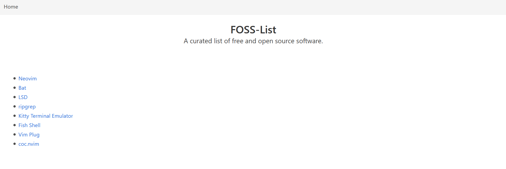
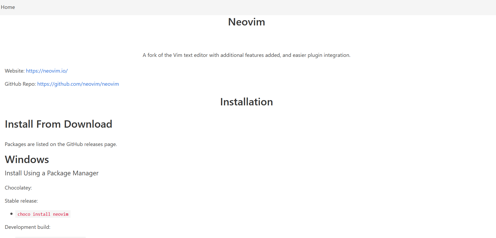
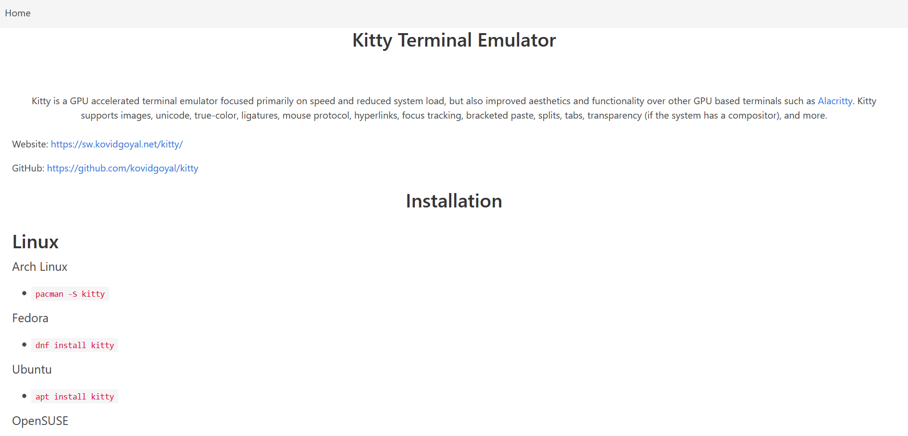

# Getting Started with Create React App

This project is a curated repository of free and open source software. The goal of the project is to prototype a hub containing a list of useful open source software, a brief description, and a list of package managers for each entry in a single unified hub.

